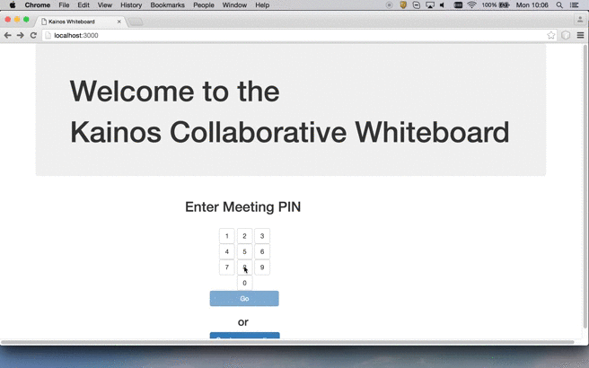
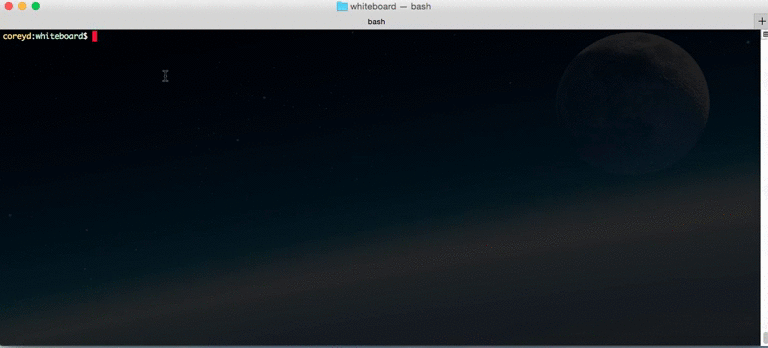

# Whiteboard

The goal of Kainos Whiteboard is to allow people to collaborate on projects through its whiteboard functionality and use of real time communication. Using webRTC it allows for in-browser video conferencing and its whiteboard feature allows any participant in the call to effectively plan or communicate their ideas through drawing sketches and diagrams that can be moved, rotated and deleted as needed. It aims to improve the way teams work together across multiple geographical locations.



For more information, please visit this website: http://kainossoftwareltd.github.io/Whiteboard/  

#Getting Started
##Online Access
To access the Kainos Collaborative Whiteboard through your browser, go to the following link: https://kainoswhiteboard.herokuapp.com/ 
This will allow you to communicate with others. However, you will not be able to use your own XirSys account or SMTP server and you will be unable to add any new contacts for the “Create New Meeting” screen.

In order to avail of these features you will need to install the program locally.

##Local Installation
###Prerequisites
You will need to download:
* Node.js version 0.10.25

The installer for this can be found here: https://nodejs.org/en/blog/release/v0.10.25/
* Npm version 3.3.10

Installation instructions for this can be found here: https://www.versioneye.com/nodejs/npm/3.3.10

###Installing
1. In Terminal/Command Line run: git clone https://github.com/KainosSoftwareLtd/Whiteboard.git 
2. In the whiteboard folder run npm install to download all required dependencies.
3. Change directory to the bin folder and run node www

4. You now can access the site at http://localhost:3000/


#Configuration

##SSL
You will need to generate an SSL key and certificate in order for the program to run on a HTTPS server and thus avoid any issues with browsers like Chrome denying access to your localhost.

These can be generated on Mac by using Keychain Access. Please follow the instructions found [here](https://certsimple.com/blog/localhost-ssl-fix) and store the generated keys in the 'whiteboard' folder.

Instructions for generating these files on windows can be found [here](http://www.robbagby.com/iis/self-signed-certificates-on-iis-7-the-easy-way-and-the-most-effective-way/).

Once these files have been generated and stored in the 'whiteboard' folder, you will need to alter the following code in 'whiteboard/bin/www':

```javascript
var options = {
  key: fs.readFileSync('../[NAME OF KEY FILE]'),
  cert: fs.readFileSync('../[NAME OF CERTIFICATE FILE]') 
};
```


##XirSys
You will also need to create a XirSys account. This can be done via their website:
https://xirsys.com/ 

Once you have created an account you will need to enter the following details to the “user.json” file in the format outlined below:

```javascript
{
   "form": 
    {
         "ident": "<UserName>",
         "secret": "<API_Authentication_Key>",
         "domain": "<YourDomain>",
         "application": "<YourApplication>",
         "room": "<YourRoom>",
         "secure": 1
    },
    "json": true
}
```

##SMTP
In order to make use of the invite email functionality you will also need to add an SMTP server.
A gmail account provides an SMTP server. This will need to be added to the invite.js file (whiteboard/routes/invite.js) as shown below:
```javascript
var transporter = nodemailer.createTransport('smtps://<YourDomain>%40gmail.com:<YourPassword>@smtp.gmail.com');
```

##Adding New Contacts
Currently displaying people that are available to invite is handled as part of InviteCtrl.js (whiteboard/public/js/controllers/InviteCtrl.js) as shown below:

```javascript
{
   id: 1,
   userImage: ***REMOVED***
   name: Test Name,
   department: 'Test Department',
   email: 'testdepartment@kainos.com'
},
```
In order to add people to invite for this meeting their details will need to be added to this file in the appropriate format and each person must have a unique id. Therefore, if I wanted to add a second potential invitee I would add:
```javascript
{
    id: 1,
    userImage: ***REMOVED***
    name: Test Name,
    department: 'Test Department',
    email: 'testdepartment@kainos.com'
},	

{
    id: 2,
    userImage: ***REMOVED***
    name: Test Name2,
    department: 'Test Department2',
    email: 'testdepartment2@kainos.com'
},
```

#Connecting Another Computer To Localhost
Once you have whiteboard running on your local machine, others will be able to join meetings that you host. To do this they must enter the IP address of your machine into their web browser in the following format:

`http://IPADDRESS:3000`

From here the user will be able to enter a meeting room pin or they can directly connect to a meeting by entering ammending their browser URL to the following:

`http://IPADDRESS:3000/board/ROOMPIN`

NOTE: Some browsers (such as the latest version of Google Chrome) may prevent access to a computer's camera and microphone and thus prevent real-time communication.

#Testing
To run associated tests Karma must be installed. To do this follow the instructions on the Karma website. 

Run karma `start karma.conf.js` from the whiteboard folder in terminal. Test output will be displayed in the terminal.

####NOTE
If you have added your own contacts then you will also need to edit InviteCtrlTests.js (whiteboard/test/unit/InviteCtrlTests.js).

You will need to edit the data stored in `var mockTableTestData` by replacing any existing contacts with the contacts you have added.
The information must be entered in the following format and must match the information you have added to InviteCtrl.js:
```javascript
[
 {
    id: 1,
    userImage: ***REMOVED***
    name: Test Name,
    department: 'Test Department',
    email: 'testdepartment@kainos.com'
 },	

 {
    id: 2,
    userImage: ***REMOVED***
    name: Test Name2,
    department: 'Test Department2',
    email: 'testdepartment2@kainos.com'
 }
];
```

#Q&A
**Q: What browsers are supported?**

**A:** Currently most browsers except for Safari support WebRTC to some capacity. More in-depth details can be found here, http://iswebrtcreadyyet.com/ 

**Q: How many connections can there be to any one meeting?**

**A:** Four users/connections can access a room at any one time

**Q: Are there any costs associated with a XirSys account?**

**A:** This depends on the plan you choose. XirSys offer a free plan which provides 100MB, 10 concurrent TURN connections and unlimited STUN usage.


#Built With
*	Angular JS
*	Fabric.js
*	Node.js
*	EasyRTC

#Authors
* **Michael Kemp** – Initial creator of the project.
* **Corey Duffy** – Making project open source and minor bug fixes.

#License
This project is licensed under the MIT License – please see the LICENSE file for details.
